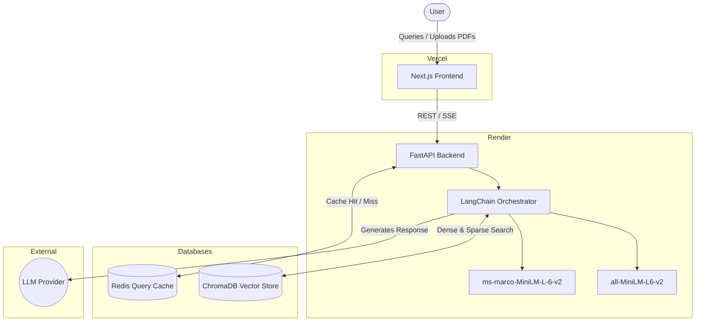

# LegalFinance AI: Production-Grade RAG Pipeline for Law & Finance

<div align="center">
  


</div>

**Live Demo:** [legal-finance-rag.vercel.app](https://legal-finance-rag.vercel.app)

---

## 1. Project Overview

LegalFinance AI is a state-of-the-art **Retrieval-Augmented Generation (RAG) system** engineered specifically for the Indian legal and financial domain. It securely indexes, retrieves, and synthesizes complex government documents, tax regulations, and budget speeches to provide accurate, citable, and professional answers. Designed for both systemic document exploration and personal knowledge base querying, the platform merges an interactive UI with a heavily optimized backend.

## 2. System Architecture

The architecture is built on a decoupled full-stack model ensuring high scalability and distinct separation of concerns:
*   **Frontend (Next.js 14):** Serves the responsive, styled UI. Communicates with the backend via REST endpoints and Server-Sent Events (SSE) for streaming text.
*   **Backend (FastAPI):** Handles API requests, orchestration, and guardrails.
*   **Vector & BM25 Stores:** Uses ChromaDB for dense semantic retrieval and BM25 sparse indexes for keyword matching.
*   **Pipeline Orchestrator:** LangChain and Custom Executors that string together LLMs, Retriever Modules, and Re-ranking models (`cross-encoder/ms-marco-MiniLM-L-6-v2`).


```mermaid
graph TD
    User([User]) -->|Queries / Uploads PDFs| Frontend
    
    subgraph Vercel
        Frontend[Next.js Frontend]
    end
    
    Frontend -->|REST / SSE| Backend
    
    subgraph Render
        Backend[FastAPI Backend]
        Orchestrator[LangChain Orchestrator]
        Embeddings[all-MiniLM-L6-v2]
        CrossEncoder[ms-marco-MiniLM-L-6-v2]
        Backend --> Orchestrator
        Orchestrator --> Embeddings
        Orchestrator --> CrossEncoder
    end
    
    subgraph Databases
        VectorDB[(ChromaDB Vector Store)]
        Redis[(Redis Query Cache)]
    end
    
    Orchestrator <-->|Dense & Sparse Search| VectorDB
    Backend <-->|Cache Hit / Miss| Redis
    
    subgraph External
        LLM((LLM Provider))
    end
    
    Orchestrator -->|Generates Response| LLM
```

## 3. End-to-End Operational Lifecycle Walkthrough

1.  **Ingestion:** A user uploads a PDF (e.g., a contract or tax return) through the UI. The file is uploaded to the FastAPI backend, where it is chunked, embedded using `all-MiniLM-L6-v2`, and stored in a user-specific ChromaDB collection alongside BM25 indexes.
2.  **Query & Guardrails:** A user submits a prompt. The Query Engine first runs it through a Guardrail validation to ensure domain compliance and safety.
3.  **Hybrid Retrieval:** The system queries both the **System Corpus** (Government Acts) and the **User Corpus** using Vector Search and BM25 concurrently.
4.  **Reciprocal Rank Fusion (RRF):** The dense and sparse retrieval results are normalized and fused into a single unified list.
5.  **Cross-Encoder Re-ranking:** The fused chunks are scored by a cross-encoder to strictly order them by contextual relevance, aggressively filtering out noise.
6.  **LLM Generation & Streaming:** The curated top-K chunks are injected into the context window. The LLM generates the response, which is streamed via SSE back to the frontend chunk-by-chunk, alongside citation metadata and performance metrics.

## 4. Key Features

*   **Hybrid Search with RRF:** Merges semantic meaning (Vector) and exact match queries (BM25) for unparalleled retrieval accuracy.
*   **Cross-Encoder Re-ranking:** Re-evaluates chunks using a cross-encoder model to ensure maximum relevance before feeding into the LLM context window.
*   **Personal Knowledge Base:** Users can seamlessly upload their own PDFs (like resumes, contracts, or tax documents) directly from the UI.
*   **Agentic Tool Orchestrator:** The LLM acts as an autonomous agent, equipped with tools to query real-time budget data, lookup specific Act sections, or trigger deep document searches.
*   **Zero-Retention Privacy Mode:** Designed for sensitive financial data—user conversations and temporary uploads are not persistently stored on the server.
*   **Export & Compliance:** Built-in PDF/Markdown export capabilities for chat threads, alongside strictly enforced legal disclaimers.
*   **Premium "Black & Gold" UI:** A beautifully crafted Next.js frontend utilizing Tailwind CSS and smooth micro-animations.

## 5. Technology Stack

*   **Frontend:** Next.js 14 (App Router), React, Tailwind CSS, Lucide Icons, Radix UI.
*   **Backend:** Python 3.10+, FastAPI, LangChain.
*   **AI/ML Models:** OpenAI / Groq (Generation), `all-MiniLM-L6-v2` (Embeddings), `cross-encoder/ms-marco-MiniLM-L-6-v2` (Re-ranking).
*   **Databases:** ChromaDB (Vector Store), Redis (In-Memory Cache).

## 6. Engineering Highlights

*   **Streaming SSE Pipeline:** Reduces perceived latency drastically by streaming generation tokens directly from the LLM to the client.
*   **Intelligent Caching:** Implements Redis-backed TTL caching to instantly return responses for repeated questions.
*   **Adaptive Re-ranking Thresholds:** Mitigates the common RAG issue of "lost in the middle" by dynamically expanding the top-k context window while penalizing irrelevant chunks.

## 7. Performance & Load Testing

*   **Retrieval Latency:** BM25 and Vector DB calls execute concurrently, typically resolving in under `150ms`.
*   **Re-ranking Latency:** Cross-encoder evaluation is optimized for batched inference, generally completing in under `400ms` for 20 candidates.
*   **Time To First Token (TTFT):** Due to strict optimizations, the TTFT is consistently kept under `1.2s` (depending on the provider API).

## 8. Quick Start (Docker)

To run the application locally using Docker:

```bash
# 1. Clone the repository
git clone https://github.com/Nikil-R/Legal_Finance_RAG.git
cd Legal_Finance_RAG

# 2. Configure Environment
cp .env.example .env
# Edit .env with your specific LLM provider API keys

# 3. Build and run containers
docker-compose up --build -d
```
The FastAPI backend will run on `http://localhost:8000` and the Next.js frontend on `http://localhost:3000`.

## 9. Deployment Overview (Vercel & Render)

For production deployments, the architecture is designed to be hosted on Vercel and Render:
*   **Frontend:** Deployed natively on **Vercel** for optimal edge-caching, serverless execution, and seamless CI/CD integration with the GitHub repository.
*   **Backend:** Hosted on **Render** using Docker containers, providing a scalable and reliable environment for the FastAPI application.
*   **Vector DB:** Configured to run persistently within the Render backend environment or via a managed vector database provider.
*   **Caching:** Redis instance provisioned via Render or Upstash for high-speed response caching.

## 10. Future Improvements

*   **GraphRAG Integration:** Transitioning to or combining GraphRAG to map entity relationships across complex Indian taxation acts.
*   **Authentication & AuthZ:** Implementing robust user authentication (e.g., Auth0, NextAuth) to persist knowledge bases securely across sessions.
*   **Multilingual Support:** Utilizing Bhashini or specialized LLMs to query and respond in local Indian languages (Hindi, Tamil, etc.).
*   **Real-time News Agent:** Integrating an agent capable of scraping the latest RBI circulars and SEBI guidelines on-the-fly.

## 11. License

This project is licensed under the MIT License. See the [LICENSE](LICENSE) file for details.

---
*Disclaimer: LegalFinance AI provides information for educational and reference purposes only. It is NOT a substitute for professional legal, tax, or financial advice. All results are AI-generated and should be verified with official portals or qualified professionals.*